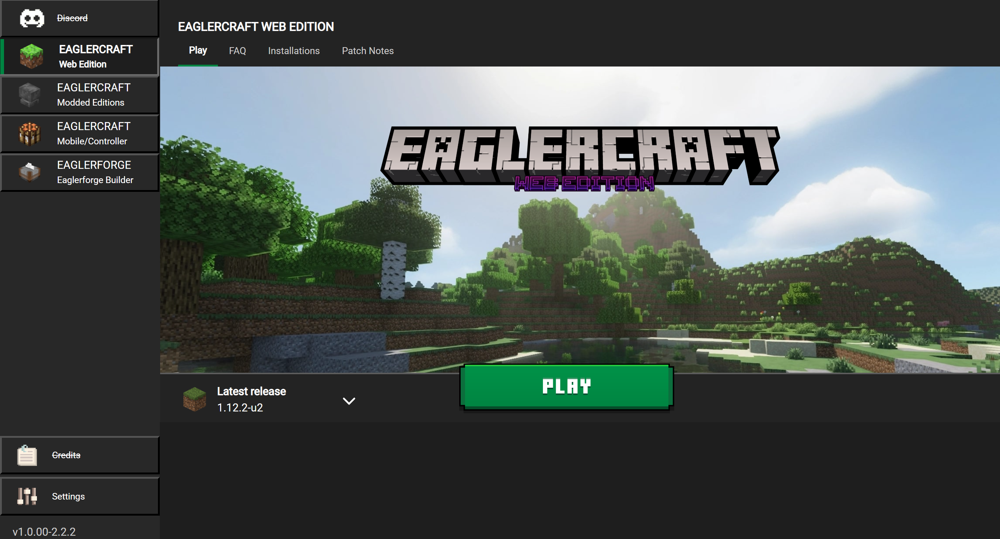

#  Eaglercraft Launcher
 A minecraft themed launcher for Eaglercraft! 
 Containing some of the best clients all in one place!

 

 ## Versions
 __v1.0.00__ - Main code with lots of small updates!

 

## Installation
 Currently just download the repository for the source code! 
 Future plans for an offline file may be possible!

## Features Planned

Click here to expand feature list

- [X] Add the servers screen
- [X] Add Credits screen
- [X] Add Settings screen
- [x] Rewrite some of the css and js
- [x] Organize code, and add comments
- [ ] Add a customizable launcher selector
- [x] Save last played game
- [x] Add FAQ screen
- [x] Add Installations screen
- [x] Add Mods screen
- [ ] Add Skins screen
- [x] Add Patch Notes screen
- [X] Fix display errors
- [ ] Offline launcher download?

